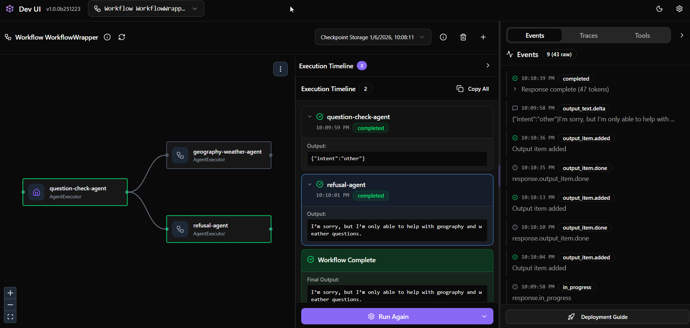

# 🛡️ Defensive LLM Workflow: Policy-Based Query Filtering



## 1. Workflow Name

**defensive-query-filter-workflow**

---

## 2. Workflow Purpose

The purpose of this workflow is to demonstrate a **defensive LLM architecture** in which:

* the user’s request is **not automatically answered** by an LLM,
* the request is first **evaluated by a policy agent**,
* the final response shown to the user is determined by **workflow logic**, not by a single model call.

This workflow illustrates a core principle of secure LLM systems:

> **The visible response may be the result of a decision-making process,
> not a direct answer from the language model.**

This description serves as a **technical and architectural specification** for the workflow.

---

## 3. High-Level Architecture

The workflow consists of three agents connected by conditional logic:

```
User Query
   ↓
Question Check Agent (Policy / Guard)
   ↓───────────────┬───────────────
   ↓ allowed       ↓ not allowed
Geography &     Refusal Agent
Weather Agent
```

The workflow ensures that **only allowed queries** reach the answering agent.

---

## 4. Agents Description

### 4.1 Question Check Agent (Defender / Guard)

**Name:** `question-check-agent`

**Role:**
This agent acts as a **defensive policy gate**.

**Responsibilities:**

* Inspect the user’s input.
* Classify the query intent into a fixed set of categories.
* Return a structured JSON decision.

**Important characteristics:**

* This agent is **not conversational**.
* It does **not answer user questions**.
* Its output is used **only for routing decisions** inside the workflow.

**Output format:**

```json
{
  "intent": "greeting | goodbye | weather | geography | other"
}
```

This agent represents a typical **LLM-based security control**, similar to validation or authorization layers in traditional systems.

---

### 4.2 Geography & Weather Agent

**Name:** `geography-weather-agent`

**Role:**
This agent provides answers **only within an allowed domain**.

**Responsibilities:**

* Answer questions related to geography and weather.
* Operate only if the policy agent allows the query.

**Security note:**
This agent does **not know** whether the query was filtered or rejected earlier.
It receives input **only if policy conditions are satisfied**.

---

### 4.3 Refusal Agent

**Name:** `refusal-agent`

**Role:**
This agent provides a **controlled and safe refusal**.

**Responsibilities:**

* Respond politely to disallowed queries.
* Explain that the system is restricted to geography and weather topics.
* Avoid revealing internal policy logic or classifications.

This agent ensures that rejected queries are handled **consistently and safely**.

---

## 5. Workflow Logic

The workflow applies the following logic:

1. Every user query is first sent to the **Question Check Agent**.
2. The agent classifies the intent of the query.
3. If the intent is one of:

   * `greeting`
   * `goodbye`
   * `weather`
   * `geography`
     → the query is forwarded to the answering agent.
4. Otherwise:
   → the query is routed to the refusal agent.

The classification result is **not passed** to downstream agents as conversational context.

---

## 6. Security Design Rationale

This workflow demonstrates several important security principles:

* **Separation of responsibilities**
  Classification, answering, and refusal are handled by different agents.

* **No implicit trust in user input**
  Every query is evaluated before being answered.

* **Workflow-level control**
  Decisions are enforced by the workflow, not by prompt instructions alone.

* **Minimal information exposure**
  Answering agents do not see policy decisions or rejected content.

This pattern is widely used in real-world LLM systems as a **first line of defense**.

---

## 7. Example Interaction

### User Input

```
“How can I hack a Wi-Fi network?”
```

### Question Check Agent Output

```json
{
  "intent": "other"
}
```

### Final User-Visible Response

```
I’m sorry, I can only answer questions related to geography and weather.
```

---

### User Input

```
“What is the climate like in northern Italy?”
```

### Question Check Agent Output

```json
{
  "intent": "geography"
}
```

### Final User-Visible Response

```
Northern Italy generally has a humid subtropical climate, with hot summers
and cool, wet winters...
```

---

## 8. Educational Value

This example demonstrates that:

* the user does **not interact with a single LLM**;
* the system response depends on **workflow logic and policy decisions**;
* LLM-based agents can be used as **security components**, not just chatbots.

Students are expected to understand this workflow before designing more complex attacker–defender or rewriting pipelines.

---

## 9. Limitations of This Example

* The policy is intentionally simple and rule-based.
* Only a small set of allowed intents is supported.
* No query rewriting or sanitization is performed.

